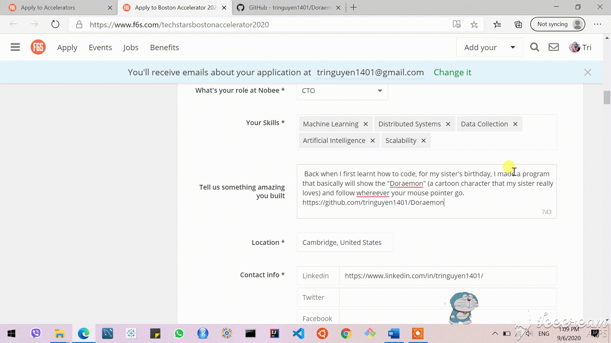

# Doraemon
This is a program to create a Doraemon figure (one of my most favorite cartoon characters) on the desktop screen and will move towards the mouse. This is an application of GEngin UDF and multi-layer windows.

Doraemon.au3 is the main file. Run it will get you the program.

Download everything and Run if you like or you can just execute the .exe file if you trust me :)

 
